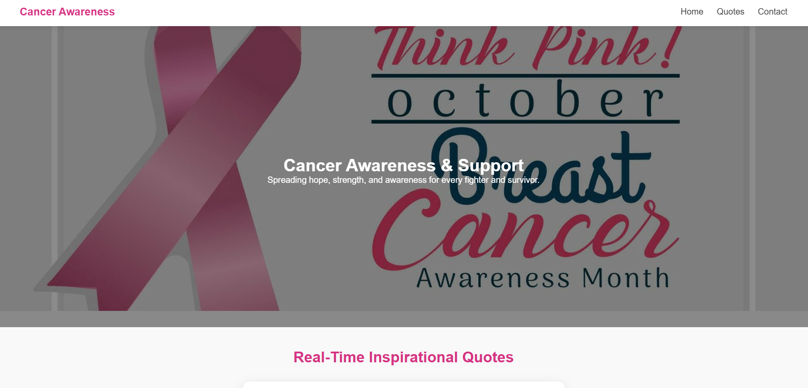
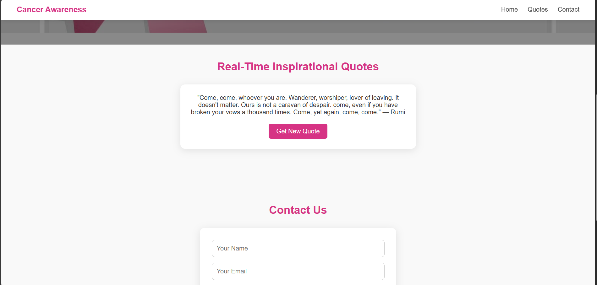
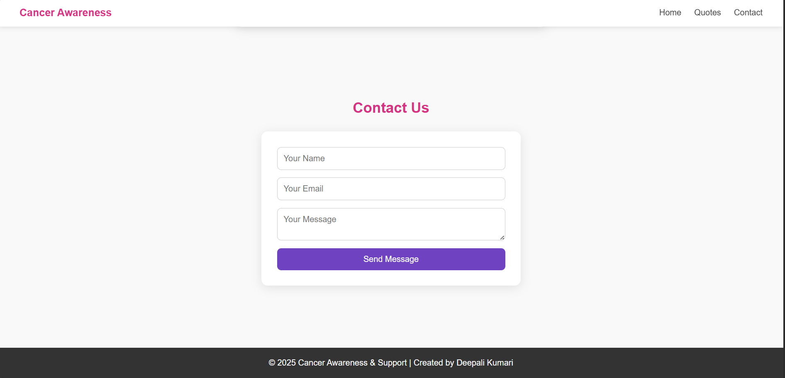

# 🎀 Cancer Awareness & Support Website

A modern, responsive Cancer Awareness & Support web page created as part of an internship assignment.  
The project includes a hero banner, real-time inspirational quotes (API), smooth animations, a contact form, and a professional UI/UX layout.

---

## 🚀 Live Demo  
🔗 **https://deepali-kumari-iitp.github.io/cancer-awareness/**

---

## 🎯 Features

- ✔️ Professional hero section with awareness banner  
- ✔️ Fixed navigation bar with smooth scrolling  
- ✔️ Real-time inspirational quotes (API integrated)  
- ✔️ Clean and responsive UI  
- ✔️ Animated text effects  
- ✔️ Contact form with polished design  
- ✔️ Organized folder structure  
- ✔️ Hosted on GitHub Pages  

---

## 🖼️ Screenshots

### **⭐ Hero Section**


### **⭐ Quotes Section**


### **⭐ Contact Section**


---

## 🛠️ Tech Stack Used

- **HTML5**
- **CSS3**
- **JavaScript**
- **GitHub Pages** (Hosting)
- **DummyJSON Quotes API**

API Used:  
https://dummyjson.com/quotes/random


---

## 📂 Folder Structure
cancer-awareness/
│── index.html
│── css/
│ └── style.css
│── js/
│ └── main.js
│── assets/
│ ├── cancerbanner.jpg
│ └── screenshots/
│ ├── hero.png
│ ├── quotes.png
│ └── contact.png


---

## 📥 How to Run Locally

```bash
git clone https://github.com/<your-username>/cancer-awareness.git
cd cancer-awareness
Open index.html in any browser
```
👩‍💻 Author

Deepali Kumari
IIT Patna — B.Sc. Computer Science & Data Analytics
Passionate about web development and clean UI/UX design.

⭐ Acknowledgements

DummyJSON API for quotes

Banner image from Vecteezy

Created as part of an internship assignment by Harika M.
💗 Thank you for checking out this project!


